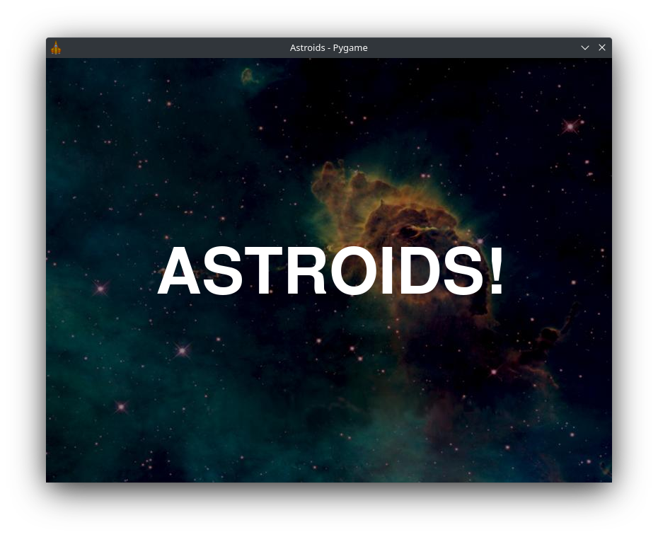
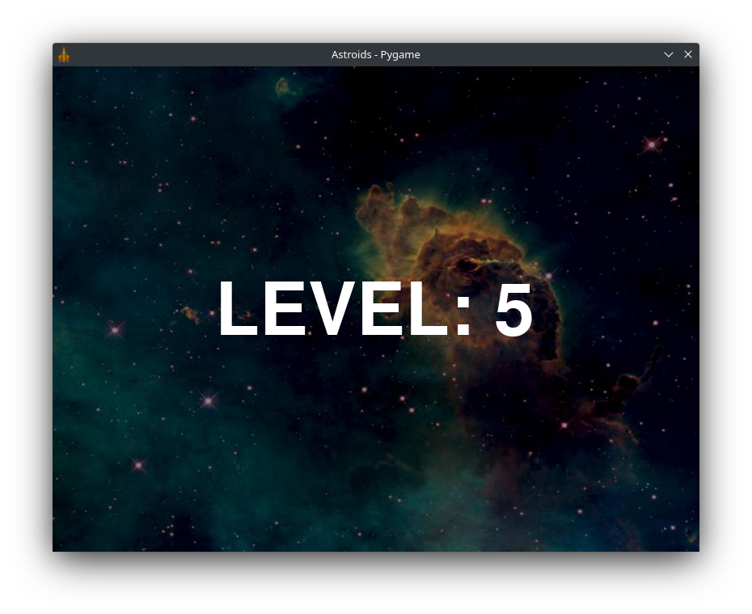
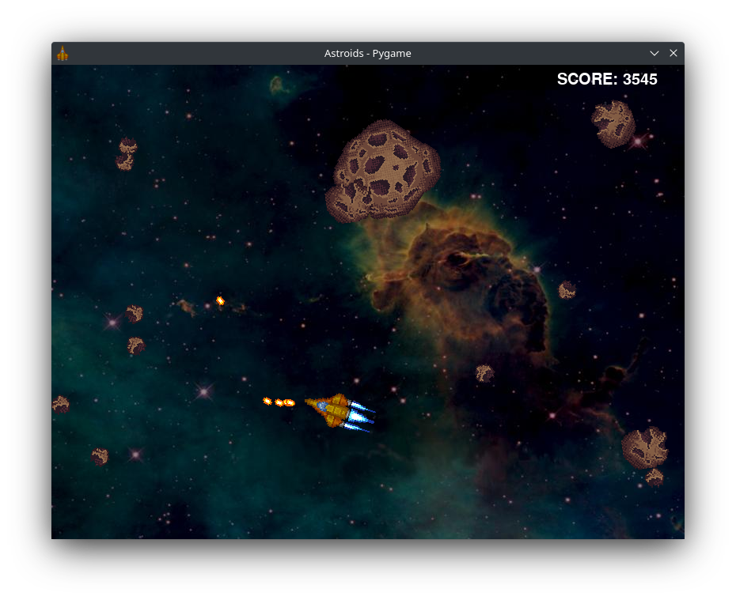
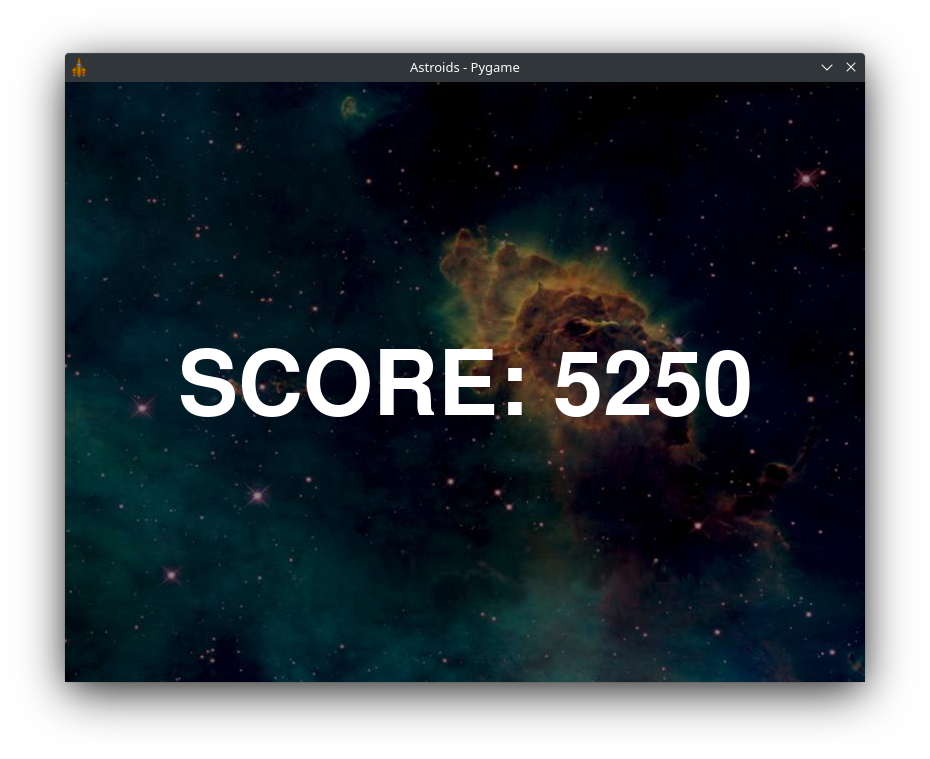

# Asteroids!

Asteroids clone written three times, in Pygame, Pygame Zero and C / SDL2.

# Controls

Up - Fires the main engines.

Left, Right - Rotates the ship.

Space - Fires the ship's weapon.

M - Pauses or resumes the music.

Escape - Quits the game.

# Python PyGame Zero

PyGame Zero with all dependencies needs to be installed.

To run the program from terminal.

    python asteroids-pygame-zero.py

If you wish to install it into your system run this command. This will add a menu entry under Game.

    sudo bash ./install-asteroids-pygame-zero.sh

If install you can also run it from the terminal with this command.

    asteroids-pygame-zero

# Python PyGame

PyGame with all dependencies needs to be installed.

To run the program from terminal.

    python asteroids-pygame.py

If you wish to install it into your system run this command. This will add a menu entry under Game.

    sudo bash ./install-asteroids-pygame.sh

If installed you can also run it from the terminal with this command.

    asteroids-pygame

# C / SDL2

SDL2 with all dependencies needs to be installed.

To compile the binary from a terminal.

    make rebuild

To run the program from terminal if successfully compiled.

    ./asteroids-sdl

If you wish to install it into your system run this command. This will compile the source code and install it. It will also add a menu entry under Game.

    sudo bash ./install-asteroids-sdl.sh

If installed you can also run it from the terminal with this command.

    asteroids

